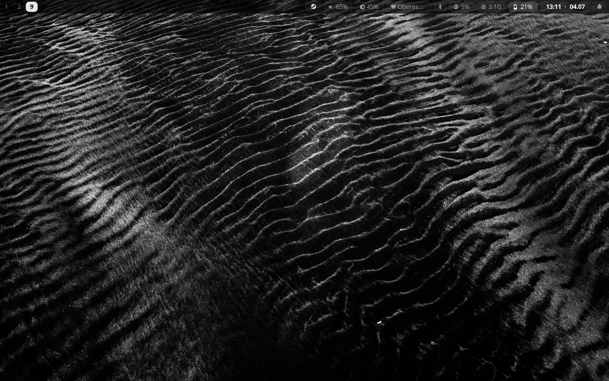
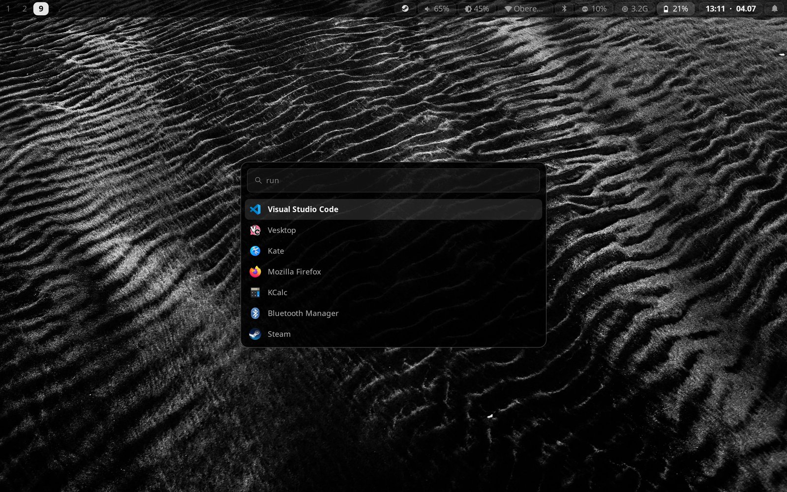
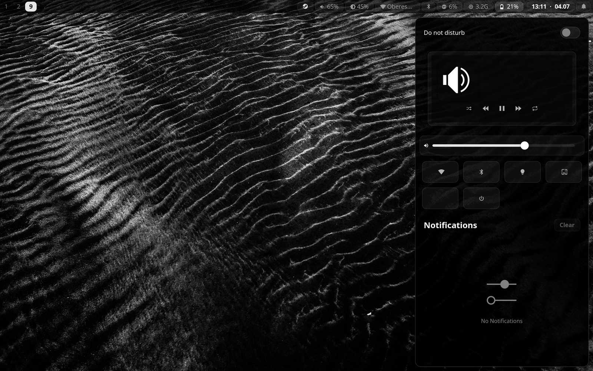
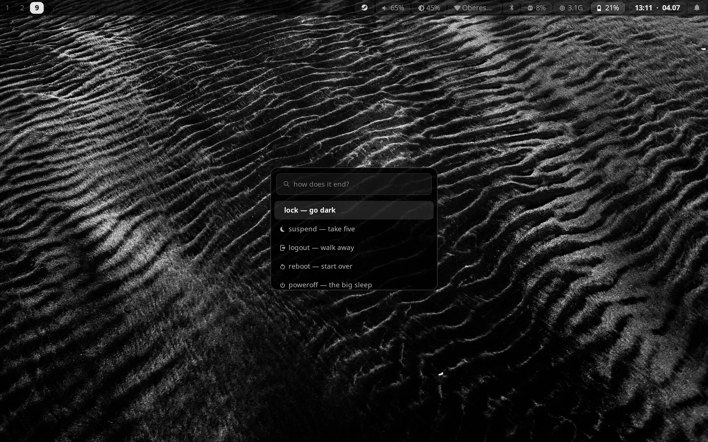
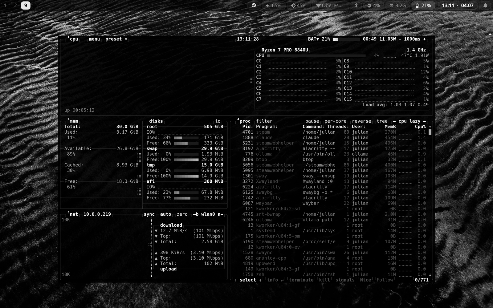

<h1 align="center">N O I R</h1>

a monochrome sway rice for CachyOS — black glass, 1px hairlines, and exactly one color: 
sodium amber <code>#e8a032</code>, spent only on what is <em>on</em> — the focused window, the active
workspace, the volume bar. 
contrast, spacing, transparency and motion do the rest of the work that color usually does.

## anatomy

| piece | what |
|---|---|
| wm | sway — 8px gaps, 2px hairline borders, native (daemonless) wallpaper |
| bar | waybar — glass pills, hover states, calendar, click-to-act modules |
| launcher | wofi — black glass, fuzzy matching |
| notifications | swaync — full control center: dnd, mpris, sliders, quick toggles |
| hud | the day's brief painted onto the wallpaper itself — imagemagick + sway's native bg, zero windows, zero daemons |
| lock | swaylock over blurred sand ripples |
| terminal | alacritty (hack) · btop + fastfetch themed to match |
| everything else | plain shell scripts in `.bin/` — zero extra daemons |

<table>
  <tr>
    <td></td>
    <td></td>
  </tr>
  <tr>
    <td></td>
    <td></td>
  </tr>
</table>

## the work engine

`Super+D` opens a project cockpit over everything in `~/Data`
(tagged `git` / `dvc` / `plain`, auto-discovered):

- open in vs code (claude in panel) · claude code terminal · plain terminal
- git status / sync (`pull --rebase` + push) / commit with review
- dvc status / sync via the project's own venv
- ssh remotes from `~/.ssh/config` → vs code remote window or terminal
- `claude mcp list` one entry away

## ai

two assistants, one keystroke each:

- **claude** (`Super+C`) — cloud, for the heavy frontier-grade agentic work
- **noir** (`Super+V`) — qwen3-vl running locally through ollama, driven by
  opencode: sees images, edits files, runs commands. free, offline, open
  source. `ai` in any shell (`ai chat` for a plain REPL)

## the ambient layer

the desktop tells you what's up without being asked:

- **hud** — meetings, open TODOs, inbox count and countdowns, composited
  bottom-left onto the wallpaper every 10 minutes (`hud.sh`, toggle in
  quick actions). calendars come as plain ICS urls in
  `~/.config/noir/calendars.conf` (`agenda.sh setup` explains — outlook,
  uni timetable, anything)
- **capture** — `Super+T`, one line, straight into the vault inbox. type
  `compile` instead and an agent sorts the inbox into the right pages,
  commits, and reports back in a notification
- **morning brief** (06:30) seeds today's journal with what's due ·
  **sunday sweep** (sun 17:00) has an agent tidy the week · a 15-min
  timer autosaves the vault. all plain systemd user timers:
  `systemctl --user list-timers | grep noir`

## notes

`Super+O` — logseq (open-source obsidian) on a plain-markdown vault at
`~/Data/personal/notes`: no database, no lock-in, git for sync, and the
local agent can edit pages directly (`ai` inside the vault). Dark with the
same amber accent, obviously.

## keys

| key | does |
|---|---|
| `Super+Space` | launcher |
| `Super+Escape` | quick actions — screenshots, wallpaper, toggles, panels |
| `Super+D` | work engine |
| `Super+C` / `Super+V` | claude / local vision agent |
| `Super+Shift+V` | local chat — fast, no tools |
| `Super+O` | notes — logseq vault |
| `Super+T` | capture a thought → vault inbox (`compile` to have an agent sort it) |
| `Super+I` | floating btop dashboard |
| `Super+/` | keybind cheatsheet, parsed live from the sway config |
| `Super+Ctrl+/` | the manual — explains all of this in-system |
| `Super+Shift+E` | power menu — <em>the big sleep</em> |

everything is documented on the machine itself: `Super+Ctrl+/`.
